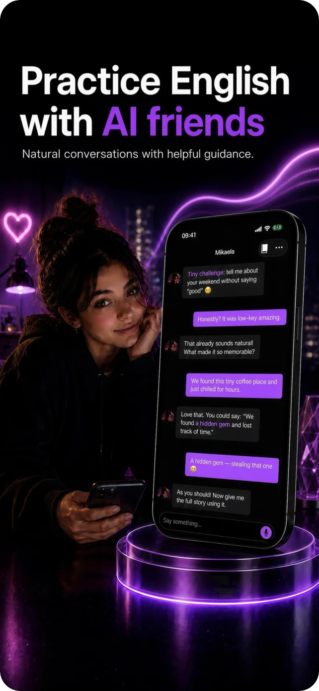
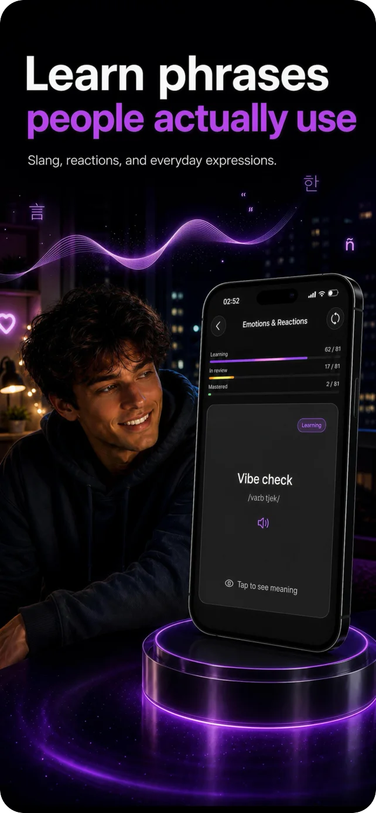
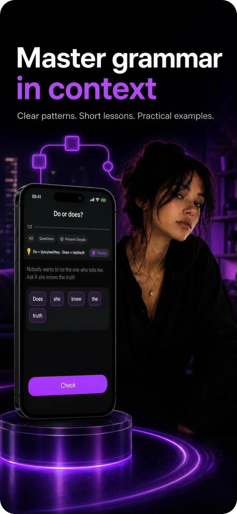
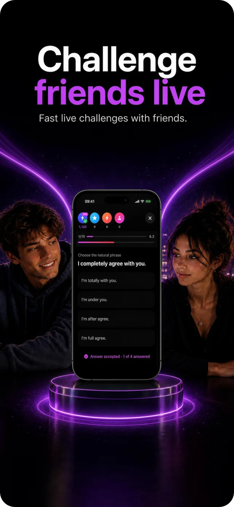

## Kantemir Vologirov

iOS engineer, 7 years in mobile. Right now I'm building **Linqo**: iOS, Android, backend and all the learning content, with AI agents (Codex/Claude Code) as part of my daily workflow.

###  Linqo

Learn the English people actually use: slang, real scenes and AI characters you can talk to.

  
  
  
  

[App Store](https://apps.apple.com/us/app/linqo-learn-real-english/id6764823350)
[Google Play](https://play.google.com/store/apps/details?id=com.vologirov.linqo)
[vologirovdigital.com/linqo](https://vologirovdigital.com/linqo?src=github)

### Stack

- **iOS:** Swift, SwiftUI, UIKit, Objective-C, Combine, Metal, async/await, XCTest
- **Android:** Kotlin, Jetpack Compose
- **Backend:** Django, Firebase (Auth, Firestore, Cloud Functions, Remote Config, App Check), TypeScript
- **Also:** Unity, watchOS, WidgetKit, RevenueCat, CI/CD

### Elsewhere

[Instagram](https://www.instagram.com/vologirov_/)
